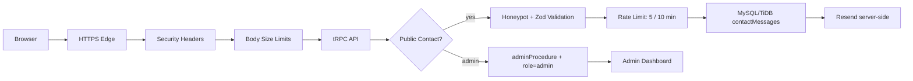

# MjTop Web Application Security & Performance Test Report

**التاريخ:** 2026-09-17

**النطاق:** موقع MjTop Full-Stack، نموذج التواصل، tRPC API، MySQL/TiDB، Resend، ولوحة الإدارة.

**المراجع:** [OWASP Web Security Testing Guide](https://owasp.org/www-project-web-security-testing-guide/)، [OWASP ASVS](https://owasp.org/www-project-application-security-verification-standard/)، و[Resend Send Email API](https://resend.com/docs/api-reference/emails/send-email).

## 1. الخلاصة التنفيذية

تمت إضافة طبقة اختبارات أمن وأداء قابلة للتكرار، مع ضوابط حماية فعلية داخل الخادم. تشمل التغييرات Security Headers وContent Security Policy وHSTS على طلبات HTTPS، تعطيل `x-powered-by`، تقليل أحجام body، Rate Limiting لنموذج التواصل، Honeypot، Zod input validation، حماية `admin` بصلاحية `admin`، وخصائص Cookies الآمنة. الاختبارات المحلية الحالية ناجحة: **9 اختبارات Vitest، وSecurity Smoke محلي وعبر HTTPS Preview، وفحص TypeScript، وبناء الإنتاج**.

اختبار الأداء المحلي استخدم endpoint خفيفاً (`auth.me`) حتى 1000 طلب متزامن، وليس endpoint إرسال الرسائل، لتجنب إنشاء رسائل أو إرسال بريد أثناء اختبار الضغط. لم يتم تشغيل سيناريوهات k6 الطويلة على النطاق العام لأنها تحتاج قراراً منفصلاً حول نافذة الاختبار ومراقبة قاعدة البيانات والبريد.

## 2. مسار الحماية



## 3. مصفوفة الاختبارات

| المجال | ما تم تنفيذه أو فحصه | الحالة | الدليل |
|---|---|---:|---|
| Functional | حفظ نموذج التواصل، حالة النجاح، سجل الرسالة، تحديث الحالة من لوحة الإدارة | منفذ | `server/email.delivery.test.ts` وBrowser smoke |
| Authentication | Manus OAuth موجود، مسار تسجيل الخروج يمسح Cookie | منفذ جزئياً | `server/auth.logout.test.ts` |
| Authorization | الوصول إلى `admin.messages` مرفوض للمستخدم العادي بـ `FORBIDDEN` | منفذ | `server/security.test.ts` |
| Session/Cookie | `HttpOnly`، `Secure` على HTTPS، `SameSite=None`، `Path=/`، وعدم وضع session في URL | منفذ | `server/security.test.ts` و`server/_core/cookies.ts` |
| Brute-force / Spam | 5 طلبات لكل بصمة خلال 10 دقائق + Honeypot | منفذ | `server/contact.security.test.ts` و`server/rateLimit.ts` |
| Input Validation | حدود الاسم ووسيلة التواصل والرسالة، ورسائل طويلة تُرفض | منفذ | `contactInput` و`server/security.test.ts` |
| Security Headers | CSP، `frame-ancestors 'none'`، X-Content-Type-Options، Referrer-Policy، Permissions-Policy، X-Frame-Options | منفذ | `server/security.ts` و`tests/security/smoke.mjs` |
| HSTS | `Strict-Transport-Security` يضاف عندما يكون الطلب HTTPS | منفذ | `server/security.ts` وHTTPS Smoke |
| API Access | الطلب غير المصادق إلى لوحة الإدارة لا ينجح | منفذ | `tests/security/smoke.mjs` |
| SQL Injection | استخدام Drizzle query builder وعدم تركيب SQL من مدخلات العميل في المسارات المضافة | مراجعة ثابتة | `server/db.ts` |
| XSS | React escaping + Zod validation + CSP؛ لا يوجد `dangerouslySetInnerHTML` في الميزة | مراجعة ثابتة | `client/src/pages/Home.tsx` وCSP |
| CSRF | API يعتمد على Cookie/session وسياق tRPC؛ يلزم DAST مخصص لاختبار جميع طرق المتصفح | يحتاج DAST | خارج الاختبارات المحلية |
| TLS/Certificate/Ciphers | HTTPS يعمل في Preview؛ فحص الشهادة وسلسلة الشهادة وCipher يحتاج SSL Labs أو بيئة النشر النهائية | يحتاج بيئة النشر | لا يُستنتج من HTTP status وحده |
| Password Hashing | لا يوجد Login بكلمات مرور محلية؛ الهوية مفوضة إلى Manus OAuth | غير منطبق حالياً | لا يوجد password column |
| MFA/OTP/Reset | غير موجودة لأن المصادقة الحالية OAuth-only | غير منطبق حالياً | يضاف عند إدخال local auth |
| Load | 10، 50، 100، 500، 1000 concurrent requests، 3 جولات لكل مرحلة | منفذ محلياً | `tests/performance/local-load.mjs` |
| Stress/Spike/Soak | سيناريوهات k6 جاهزة: 100→500→1000→2000، spike، وsoak | جاهز غير منفذ | `tests/performance/contact-form.k6.js` |
| Recovery | يجب تشغيله بعد اختبار الضغط على بيئة النشر: راقب عودة p95 و5xx إلى baseline | يحتاج بيئة النشر | إجراء لاحق |

## 4. نتائج اختبار الأداء المحلي

**Endpoint:** `GET /api/trpc/auth.me`

**الجولات:** 3 لكل مرحلة

**الأخطاء:** 0 في كل المراحل

| التزامن | الطلبات | Requests/s | p50 | p95 | p99 | أخطاء |
|---:|---:|---:|---:|---:|---:|---:|
| 10 | 30 | 271.62 | 10.23ms | 26.90ms | 110.45ms | 0 |
| 50 | 150 | 1,893.81 | 36.66ms | 71.92ms | 78.46ms | 0 |
| 100 | 300 | 2,373.90 | 49.47ms | 110.87ms | 123.25ms | 0 |
| 500 | 1,500 | 3,154.44 | 208.89ms | 417.50ms | 466.56ms | 0 |
| 1000 | 3,000 | 4,349.23 | 339.62ms | 627.72ms | 669.24ms | 0 |

هذه أرقام **بيئة sandbox محلية** وليست SLA للإنتاج. Endpoint `auth.me` لا يكتب قاعدة البيانات ولا يرسل Resend؛ لذلك لا تمثل قدرة مسار `contact.submit` على تحمل ضغط كتابة وإرسال بريد.

## 5. أوامر التشغيل

```bash
# Unit + security tests
pnpm test

# Local security smoke
BASE_URL=http://localhost:3000 pnpm test:security

# HTTPS preview smoke
BASE_URL=https://3000-ijlwnd70rlku16yeo9vvy-4d3a792e.sg2.manus.computer pnpm test:security

# Local performance baseline through 1000 concurrent requests
pnpm test:performance:local

# k6 load/stress/spike/soak suite after installing k6
BASE_URL=https://your-production-domain.example pnpm test:performance
```

## 6. القيود والخطوات المطلوبة قبل الإنتاج

لا يُنصح بتشغيل k6 على `contact.submit` في الإنتاج قبل إضافة test recipient أو feature flag، لأن المسار يكتب في قاعدة البيانات ويرسل بريداً. يلزم تنفيذ الاختبار في نافذة متفق عليها مع مراقبة CPU وRAM وMySQL connections وResend response rate و4xx/5xx وp95/p99.

قبل اعتماد الإنتاج، يجب فحص شهادة النطاق النهائي وسلسلة TLS وTLS 1.2/1.3 وغياب cipher suites الضعيفة بواسطة أداة خارجية، ثم إعادة تنفيذ load/stress/spike/soak وRecovery على نسخة مراقبة. عند إضافة local password authentication مستقبلاً، يجب إضافة اختبارات password hashing وreset tokens وMFA وsession rotation وconcurrent sessions.
